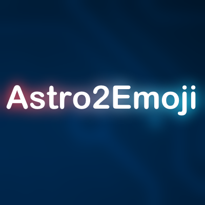

  

# Astro2Emoji Editor
### A Lightweight alternative to AstroBP, with Duo Mode and Websockets Support!

## Table Of Contents:
- Opening
- Usage
- License

### Opening Astro2Emoji.
You will need the following things to open Astro2Emoji:
- GDevelop (specifically, [5.0.135](https://github.com/4ian/GDevelop/releases/tag/v5.0.135), since the new updates are kinda sh*t)

Open the project by going to File > Open Project, or by using the Shortcut `Ctrl + O`, and select the game.json file, if it asks you about an autosave, click yes.

### Usage
You can use this editor however youd like, as i lost all interest in GDevelop.

### License
This Project is Licenced by the `MIT License`
